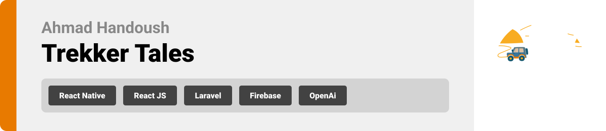
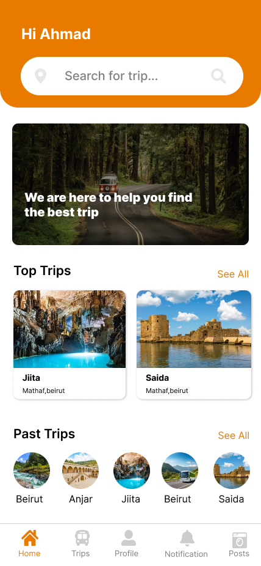
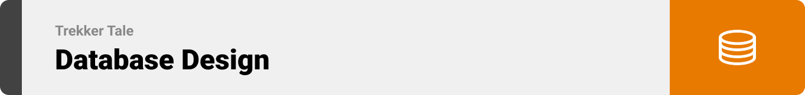

<br><br>

<!-- project philosophy -->


### Project Philosophy

Trekker tales Application, the ultimate solution for organizing seamless and cooling adventures for children, teachers, and parents alike. Trekker Tales offers a user-friendly interface where organizers can effortlessly coordinate trip logistics, from selecting destinations and activities to managing permissions and safety protocols. Meanwhile, parents can stay informed and involved through real-time updates, ensuring peace of mind as their children embark on thrilling journeys. With Trekker Tales, we aim to redefine the trip experience, promoting camaraderie, safety, and pure joy for all involved parties.

### User Stories

### Admin

- As an admin, I want to create a trip and know all the children booked in that trip and update its details.
- As an admin, I want to add the coordinator of the trip to organize everyting trelated to it.
- As an admin, I want to enhance the app's content by adding new places that users might find interesting.

### Parents

- As a parent, I want to browse the track of the available trips, so I can find the best trip for my childrens.
- As a parent, I want to browse the facilities included in the trip, so I can choose according to my preferences.
- As a parent, I want to know the locations included in the trip and its main destination.

### Teacher

- As a teacher, i want to communicate with parents to organize everything relaetd to the trip.
- As a teacher, i want to access my current location to be shown for the parents on the map.
- As a teacher, i want to add posts about the trip's activities during the day whole day.

<br><br>

<!-- Tech stack -->


### Trekker Tales is built using the following technologies:

- This project uses the [React Native expo app development framework](https://reactnative.dev/). React Native is a cross-platform hybrid app development platform which allows us to use a single codebase for apps on mobile, desktop, and the web.
- For persistent storage (database), the app uses the [Async Storage](https://react-native-async-storage.github.io/async-storage/) allowing data to be stored locally on the device.
- This Project uses Laravel framework for backend,Laravel serves as a backend framework for PHP web development, offering features and tools that streamline backend processes, such as routing, database management, authentication, and API development.
- Our app brings geographical contexts to life using the Google Maps SDK. This integration allows us to display detailed maps, complete with interactive markers for each destination.

<br><br>

<!-- UI UX -->


> We designed Coffee Express using wireframes and mockups, iterating on the design until we reached the ideal layout for easy navigation and a seamless user experience.

- Project Figma design [figma](https://www.figma.com/design/FKqMn9oAlrqlpZv8LUgSdb/Trekker-Tales?node-id=101-559&t=D8UGiDHsfVko8XH6-0)

### Mockups

| Login screen                   | Home Screen                 | Chat Screen                  |
| ------------------------------ | --------------------------- | ---------------------------- |
|  |  |  |

<br><br>

<!-- Database Design -->



<br><br>

<!-- Implementation -->


### User Screens (Mobile)

| Login Screen                       | Register screen                | Home screen                      | Home screen        |
| ---------------------------------- | ------------------------------ | -------------------------------- | ------------------ |
|  |  |  |  |
| Trips screen                       | Maps Screen                    | Profile Screen                   | Chat Screen        |
|                |              |                |          |

### Admin Screens (Web)

| Login screen                        | Main dashboard                  | Trips screen        |
| ----------------------------------- | ------------------------------- | ------------------- |
|  |  |  |

<br><br>

<!-- Prompt Engineering -->


### Mastering AI Interaction: Unveiling the Power of Prompt Engineering:

- This project uses advanced prompt engineering techniques to optimize the interaction with natural language processing models. By skillfully crafting input instructions, we tailor the behavior of the models to achieve precise and efficient language understanding and generation for various tasks and preferences.

<br><br>

<!-- AWS Deployment -->


### By following these steps, we deployed the backend to Amazon Linux 202

Step 1: Update Amazon Linux 2023 Packages

````sh
sudo yum update -y
```
Step 2:

<br><br>

<!-- Unit Testing -->


<br><br>

<!-- How to run -->


> To set up Coffee Express locally, follow these steps:

### Prerequisites

1. Install [Composer](https://getcomposer.org/download/)
2. Install [Node & npm](https://nodejs.org/en/download/package-manager)
3. Database server: Any Apache HTTP Server, MariaDB database server, recommended [XAMP](https://www.apachefriends.org/download.html)

### Installation

### Frontend (React Native)

```sh
git clone https://github.com/AhmadHandoush/Trekker-Tales.git
````

1.Navigate to trekker-tales

```sh
 cd trekker-tales
```

2. Install NPM packages

```sh
npm install  npm@latest -g
```

4. Enter your API in `config.js`

```js
const API_KEY = "ENTER YOUR API";
```

### Backend(Laravel)

1. Navigate to the server directory

```sh
cd server
```

2. Install Composer dependencies

```sh
composer install
```

3. Generate the application key

```sh
php artisan key:generate
```

4. Download Laravel dependencies

```sh
php artisan migrate
```

### Admin dashboard (React JS)

1. Navigate to the admin dashboard directory

```sh
cd admin-dashboard
```

2.Install NPM packages

```sh
npm install
```

Now, the Trekker-tales, server, and admin-dashboard of Trekker Tales are set up. You can run them locally and explore their features.

Feel free to explore and enjoy using Trekker Tales!

```

```
